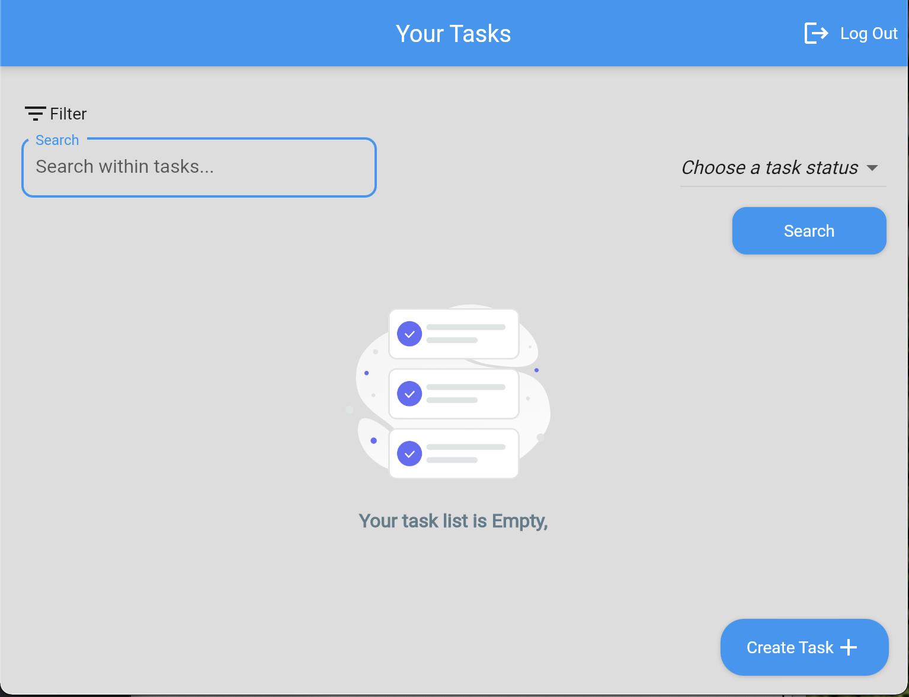
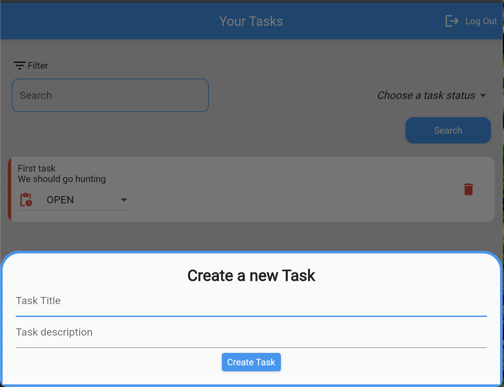
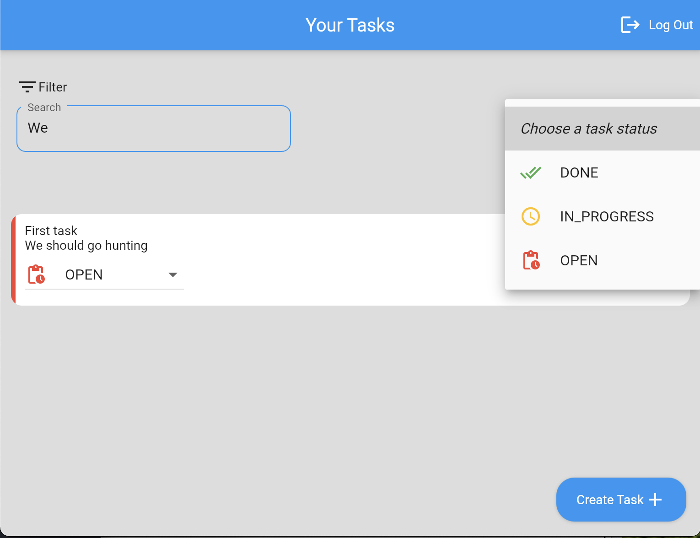
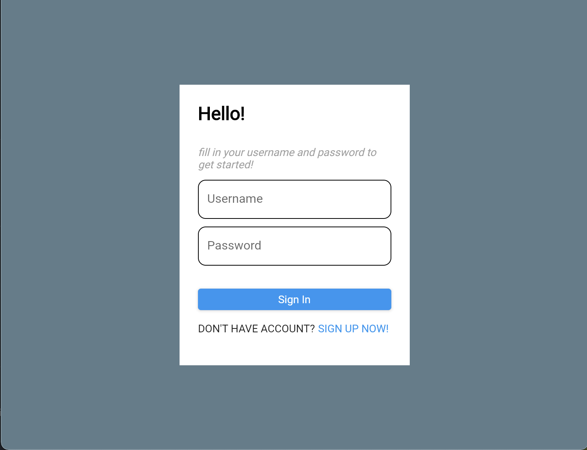

# taskmanagement_frontend

Flutter web app built to test NestJS backend API
## Operations and Features
- Basic CRUD Operations
- Authentication and caching (No Firebase)
- Clean Architecture
## Duration
3 days 

## Screenshots
>Empty List

>Creating a new task

>Filtering items

>Auth page

Don't forget to star the repo. Thanks D:)
